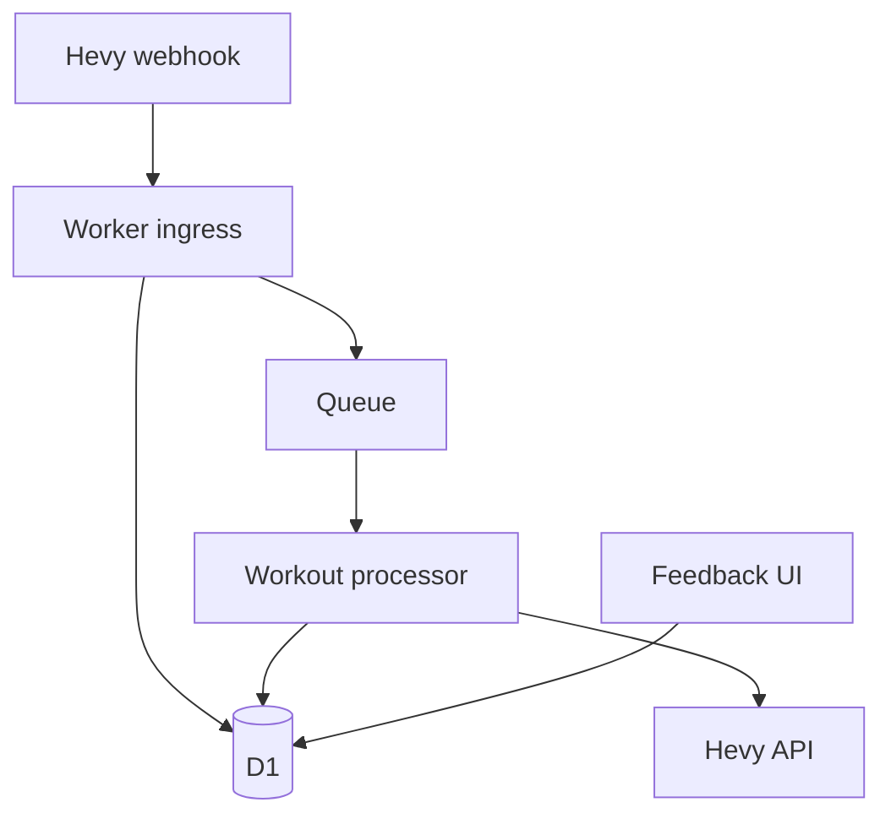

# MesoForge

Adaptive hypertrophy programming from every logged workout.

MesoForge is a recommendation engine and Hevy integration for mesocycle-based
hypertrophy training. It ingests completed workouts, combines objective
performance with subjective recovery feedback, and produces an explainable
prescription for the next exposure.

The project starts in **recommendation-only mode**. It will not modify a Hevy
routine until the decision rules have been specified, replay-tested against
historical workouts, and explicitly enabled.

## Architecture



The core hypertrophy model lives in `packages/domain`. It has no dependency on
Hevy, Cloudflare, HTTP, or a database. Infrastructure code translates external
data into domain inputs and persists the resulting decisions.

## Repository layout

```text
apps/
  worker/       Cloudflare webhook, queue consumer and scheduled handler
packages/
  domain/       Framework-independent hypertrophy contracts and rules
migrations/     Ordered D1 schema migrations
docs/adr/       Architecture decision records
```

## Local development

Requirements:

- Node.js 22 or newer
- npm 10 or newer

```bash
npm ci
npm run check
npm run dev
```

Apply the local database migration before exercising the webhook:

```bash
npm run db:migrate:local
```

Copy `.dev.vars.example` to `apps/worker/.dev.vars` and replace the example
values. Never commit `.dev.vars` or API keys.

## Webhook contract

Configure Hevy to send requests to:

```text
POST /webhooks/hevy
Authorization: <the exact value stored as HEVY_WEBHOOK_AUTHORIZATION>
Content-Type: application/json

{"workoutId":"f1085cdb-32b2-4003-967d-53a3af8eaecb"}
```

The handler validates and deduplicates the event, persists it, enqueues durable
processing, and returns `200 OK`. The `workoutId` is the idempotency key.

## Hevy adapter safety

`packages/hevy` owns the runtime-validated boundary for workout retrieval,
workout-event reconciliation, routine retrieval, and routine replacement.
Reads have bounded retries under one absolute deadline. Routine writes are
blocked by default and require both an explicit enable flag and an allowlisted
routine ID; ambiguous writes are never automatically retried.

## Quality gates

`npm run check` runs formatting validation, linting, TypeScript checking, and
tests. The same command runs in GitHub Actions for every pull request and push
to `main`.

## Project management

Material work is tracked in GitHub issues. Commits and pull requests should
reference the relevant issue, and progress or validation evidence belongs in
the issue log.

## Status

MesoForge is pre-release software. The current worker safely ingests and
snapshots workouts but does not yet calculate or write live prescriptions.
